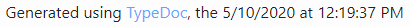

# typedoc-plugin-extras

[](https://www.npmjs.com/package/typedoc-plugin-extras)

**This plugin only works for HTML documentation.**

A [TypeDoc](https://github.com/TypeStrong/typedoc) plugin to add extras to the output documentation.

- It can set a custom top-most title name and/or link.
- It can find the `<head>` of the documents and append a favicon to it.
- It can also add date/time of generation after "Generated using TypeDoc" in the footer. (cf. the [example](#example) below)
- And more... (cf. the list of [arguments](#arguments) below)

**No date/time will be added if `--hideGenerator` is set (because the footer wouldn't exist).**

All extras are disabled by default: they are opt-in.

Feel free to ask for another extra or to make a PR 😉

## Example



You also can view an example documentation using the plugin here:

https://drarig29.github.io/typedoc-plugin-extras/

## Installation

```bash
npm install --save-dev typedoc-plugin-extras
```

## Usage

```bash
$ npx typedoc --plugin typedoc-plugin-extras [args]
```

## Arguments

The following arguments can be used in addition to the default [TypeDoc arguments](https://github.com/TypeStrong/typedoc#arguments).

- `--customTitle`<br>
  Specify a custom title, for the top-most title only.<br>
  Example: `foo`

- `--customTitleLink`<br>
  Specify a custom link for the top-most title.<br>
  Example: `https://parent-docs-site.com`

- `--customDescription`<br>
  Specify a custom meta description.<br>
  Example: `A test description`

- `--favicon`<br>
  Specify the path or URL of the favicon file.<br>
  Example: `public/favicon.ico`<br>
  **Note:** If given a path, the favicon file is copied into the documentation's output directory (`--out`).

- `--footerTypedocVersion`<br>
  Appends the TypeDoc version in the footer.<br>
  Default: `false`

- `--footerLastModified`<br>
  Appends a "Last Modified" text in the footer (e.g. "Last modified 6 min. ago").<br>
  Default: `false`<br>
  **Note:** If specified, the `--footerDate` and `--footerTime` options are ignored.

- `--footerDate` (deprecated)<br>
  Appends the date of generation in the footer (e.g. "Jul 29, 2022").<br>
  Default: `false`<br>
  **Note:** If combined with `--footerTime`, it will append "Jul 29, 2022, 3:44:42 PM GMT+2".

- `--footerTime` (deprecated)<br>
  Appends the time of generation in the footer (e.g. "3:44:42 PM GMT+2").<br>
  Default: `false`<br>
  **Note:** If combined with `--footerDate`, it will append "Jul 29, 2022, 3:44:42 PM GMT+2".

- `--favicon`<br>
  Specify a [Google Analytics](https://support.google.com/analytics/answer/1008080?hl=en&ref_topic=1008079#zippy=%2Cin-this-article%2Cstatic-website) measurement ID to insert in a `gtag.js` snippet.<br>
  Example: `abc123`<br>

## Testing

To test this plugin, you can generate TypeDoc documentation for this plugin.

To do so, you'll first need to build it:

```bash
npm run build
```

Then, you can generate the documentation with the plugin (from source):

```bash
npm test
```

## License

[MIT](./LICENSE)
